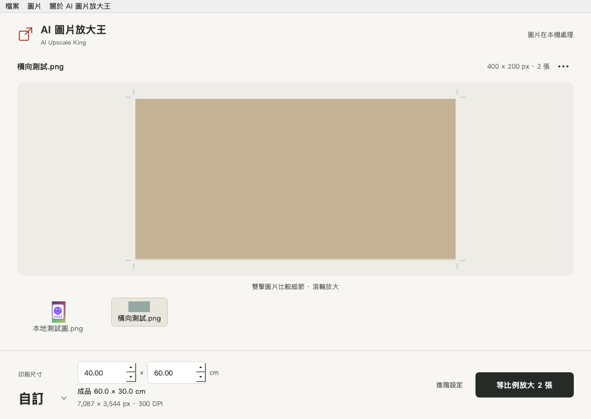

# AI 圖片放大王 · AI Upscale King

**把 AI 圖片等比例放大至印刷尺寸，全部在自己的電腦完成。**

AI Upscale King 是供設計師、插畫師及印刷製作人員使用的開源桌面圖片放大工具。支援 A1–A5、手動厘米尺寸、300 DPI、批次處理及局部比較。保留原圖方向與比例，圖片毋須上傳。

[下載正式版](https://github.com/Aesssss/ai-upscale-king/releases) · [使用教學](docs/使用教學.md) · [English](README.en.md) · [開發及構建](docs/BUILDING.md)



## 三步開始

1. 解壓適合自己系統的發佈包，開啟軟件。毋須 Python、帳號或另行下載模型。
2. 拖入圖片，選「A1」或「自訂」厘米尺寸。預設 300 DPI。
3. 按「放大至 A1」或「等比例放大」，選擇儲存位置。

| 發佈包 | 系統 | 執行方式 |
|---|---|---|
| `AIUpscaleKing-1.0.0-macOS-arm64.zip` | Apple Silicon Mac，macOS 14+ | 把 App 放到本機「應用程式」資料夾 |
| `AIUpscaleKing-1.0.0-Windows-x64.zip` | Windows 10 / 11，64 位元 | 解壓整個資料夾，執行 `AIUpscaleKing.exe` |

Windows 發佈包使用 CPU 推理，毋須 CUDA；速度取決於處理器及圖片大小。Mac 使用可用的 Apple GPU。Intel Mac、Windows ARM 並非本版二進位套件的目標。

發佈檔會附 SHA-256 校驗值。macOS App 採 ad-hoc 簽署，尚未有 Apple Developer ID 公證；Windows 包尚未有程式碼簽署。首次開啟可能出現系統提示；請依系統正常流程處理，不要關閉整個系統的安全防護。

## A1 banner 和自訂尺寸

尺寸是成品的長短邊範圍，會跟隨原圖方向排列。預設不加白邊、不裁切、不拉伸。

| 原圖比例／方向 | 指定尺寸及 DPI | 實際成品像素 | 約成品尺寸 |
|---|---|---|---|
| 3:1 橫向 banner | A1，300 DPI | 9934 × 3311 | 84.1 × 28.0 cm |
| 2:3 直向 | 40 × 60 cm，300 DPI | 4725 × 7087 | 40 × 60 cm |
| 3:2 橫向 | 40 × 60 cm，300 DPI | 7087 × 4725 | 60 × 40 cm |
| 3:1 橫向 banner | 40 × 60 cm，300 DPI | 7087 × 2362 | 60 × 20 cm |

選「自訂」後，主畫面只增加兩個厘米輸入欄。比例不同時，取尺寸範圍內最大的等比例成品；匯出前會顯示實際厘米及像素。像素為整數，比例取整差異約不超過一個像素。

## 主要功能

- Real-ESRGAN 一般圖片及動漫／插畫模型，本機分塊推理。
- 文字／Logo 保真縮放，使用 Lanczos 保持原始字形。
- A1–A5、0.1–199 cm 自訂邊長、50–600 DPI，預設 300 DPI。
- 單張或批次；雙擊圖片／按 P 比較局部細節；取消及逐張錯誤提示。
- PNG、TIFF、JPEG 匯出；PNG／TIFF 保留透明度。
- EXIF 方向校正、有效來源 ICC 轉換為 sRGB、嵌入 sRGB ICC 及解析度資訊。
- 預設一次 AI 4× 後精確調整尺寸；「加強」可做第二次 AI 重建。

較少使用的設定集中在「進階設定」。只有主動選「完整紙張 · 留白」或「完整紙張 · 置中裁切」，才會填滿完整紙張。

## 私隱與印刷品質

軟件執行時沒有圖片上傳、雲端推理、帳號、遙測、模型下載或更新查詢；兩款模型隨發佈包附帶。來源不被覆寫，輸出不複製來源 EXIF／GPS。開發時下載依賴及模型，與軟件執行時的離線處理不同。

Dropbox、iCloud 等資料夾仍可能由相應服務同步。敏感設計稿請使用未啟用同步的本機資料夾。

本版輸出 **8-bit sRGB**，不匯出 CMYK；16-bit／浮點來源會明確拒絕。需要 CMYK 時，請按印刷商提供的 ICC 在設計軟件轉換。達到指定像素／DPI 不代表恢復了真實細節；面孔、文字、商標及細紋請先比較及打樣。較大來源或 CPU 處理可能需較長時間。

## 開發、驗證及參與

使用 Python 3.12。詳細步驟、Windows CPU 依賴安裝及原生打包見 [BUILDING](docs/BUILDING.md)。

```sh
python -m venv .venv
# 啟用虛擬環境後：
python -m pip install -r requirements.txt
python scripts/download_models.py
python main.py
python -m unittest discover -s tests -v
python scripts/ui_check.py
```

GitHub Actions 在 Windows 及 macOS 上執行核心測試、Qt 操作測試、打包及實際二進位匯出驗證；只有兩平台全部通過，發佈工作才會上傳套件。測試使用公開合成圖，毋須用戶圖片。[參與指南](CONTRIBUTING.md) · [版本記錄](CHANGELOG.md) · [私隱與安全](SECURITY.md)

## 開源授權

新撰寫的應用程式碼採 [Apache-2.0](LICENSE)，容許商用及修改，須保留相關授權與通知。模型、Qt／PySide6 及其他依賴保留各自授權，見 [第三方通知](THIRD_PARTY_NOTICES.md)。

這個項目使用公開的 Real-ESRGAN 模型及 BasicSR RRDB 架構，沒有重分發參考軟件 BigIMG 的程式、品牌素材或安裝包。
